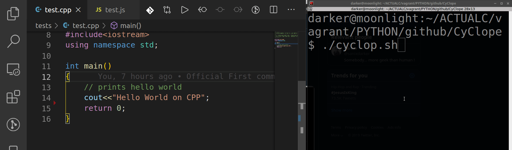

# Cyclop

## Introduction

While working recently, I had to deal with a slight problem, that of programming and executing the command each time to test my code and the changes I had just made. Admittedly, it's pretty tiring, so I searched everywhere on the web and I came across some great tools to do this like WatchMan from Facebook (by the way, too HEAVY :-( ).

The "PROBLEM" with all these solutions made in "Rust", "Python", "Java" or even "C ++" is that I must first install an entire environment, or packages for others .... let's Serious, it's way too heavy!

I think to create a tool that does not require any dependence such as the name of Cyclops in shell form, executable by all computers having bash only (99% i guess lol).

## Requirements

- **NOTHING** (By nothing, i mean, you don't need any language required, any installation required, any package required, etc...)

## How it's work

The technique is quite simple in itself, I do a hash calculation, which allows me to detect that a modification was made in a file or not, if it is the case I execute the command for which it was configure, that's it!
Easy is not it? :-)

The advantage with cyclops is that the use can be in another context, Example, I want to execute an X script if a Y.json file changes or update! Everything is configurable :-)


## How to use it


### Watch files then execute a command

You need to use the `f` parameter to watch files, and to test, you just have to hit for example :

This is how to use it :
`./cyclop.sh f '( ["./path/to/file/to/watch"]="command to execute when the file content will change" )'`

Some implementations examples:

```shell

# For C
./cyclop.sh f '( ["./tests/test.c"]="gcc ./tests/test.c && ./a.out" )'

# For C++
./cyclop.sh f '( ["./tests/test.cpp"]="g++ ./tests/test.cpp && ./a.out" )'

# For JAVA
./cyclop.sh f '( ["./tests/Test.java"]="javac ./tests/Test.java && cd tests && java Test && cd ../" )'

# For JAVASCRIPT
./cyclop.sh f '( ["./tests/test.js"]="node ./tests/test.js" )'

# For PYTHON
./cyclop.sh f '( ["./tests/test.py"]="python ./tests/test.py" )'

# For RUBY
./cyclop.sh f '( ["./tests/test.rb"]="ruby ./tests/test.rb" )'

# You can combinate or add more LUA, Go, etc...

# or multiple watching at the same time
#
./cyclop.sh f '(["./tests/test.rb"]="ruby ./tests/test.rb" ["./tests/test.js"]="node ./tests/test.js" ["./tests/test.py"]="python ./tests/test.py")'
```

### DEMO

- With an interpreted language (JavaScript):


- With a compiled language (C++):



This is a video of the test with Cyclop on VSCODE : [SEE THE VIDEO](https://www.youtube.com/watch?v=xF5nznQwhcg)

## Author

- Sanix-darker